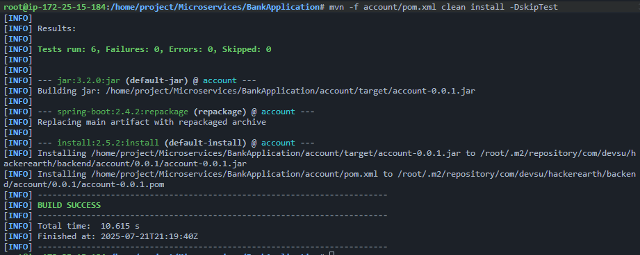
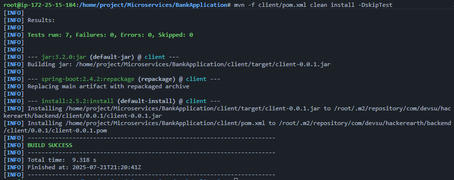

# Devsu Technical Test

Este repositorio contiene mi prueba técnica para Devsu.

## Notas importantes
- **No se sube el proyecto como archivo ZIP** porque GitHub no permite subir archivos mayores a 25MB. El archivo comprimido del proyecto pesaba 79.6MB, por lo que se optó por subir el código fuente directamente.

## Evidencia de construcción y pruebas

Se incluyen imágenes en la raíz del proyecto que muestran la construcción exitosa de los módulos. En estas imágenes se puede observar que:
- Los tests se ejecutan y pasan correctamente.
- Los proyectos compilan sin errores.

Las imágenes corresponden a la ejecución de los siguientes comandos:

```
mvn -f account/pom.xml clean install -DskipTests
```


```
mvn -f client/pom.xml clean install -DskipTests
```


## Cumplimiento de requisitos
Se cumplen todos los puntos solicitados del **F1 al F6**.

- **Pruebas unitarias**: Se encuentran implementadas en el módulo `client`.
- **Pruebas de integración**: Se encuentran implementadas en el módulo `account`.

---
